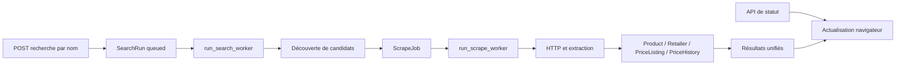

# Architecture Bendango

Dernière mise à jour : 2026-10-09.

## Organisation

Monolithe Django avec templates HTML, Tailwind CSS et JavaScript de suivi des
recherches. Une application métier principale : `tracker`.

| Zone | Responsabilité |
| --- | --- |
| `config/` | Configuration, routes racines, WSGI et ASGI |
| `tracker/views.py`, `forms.py`, `urls.py` | Parcours web, validation et routes |
| `tracker/models.py`, `migrations/` | Modèles métier et évolution du schéma |
| `tracker/adaptive_engine.py`, `adaptive_search.py` | Recherche adaptative et couverture |
| `tracker/discovery_sources.py`, `search_result_intelligence.py` | Découverte et classement des candidats |
| `tracker/services.py`, `extractors.py`, `reliable_collection.py` | Collecte et extraction des offres |
| `tracker/job_queue.py`, `job_outcomes.py`, `domain_health.py` | File SQL, états, reprises et santé des domaines |
| `tracker/unified_search.py`, `offer_search.py`, `ranking.py` | Résultats unifiés et classement |
| `tracker/templates/` | Interface publique et espace Pro héritant de `tracker/base.html` |
| `assets/css/app.css` | Thèmes Tailwind clair/sombre et composants partagés |
| `tracker/static/tracker/js/theme.js` | Préférence système, bascule et mémoire locale du thème |
| `tracker/static/tracker/css/app.css` | CSS compilé livré avec le dépôt |
| `package.json`, `pnpm-lock.yaml`, `pnpm-workspace.yaml` | Dépendances et compilation du frontend |
| `tracker/management/commands/` | Workers et commandes d'exploitation |
| `deploy/systemd/` | Exemples de services web et workers |

## Flux de recherche



Une URL saisie directement suit actuellement un chemin synchrone dans la vue
via `process_url_and_save`. Ne pas supposer que toutes les collectes sont asynchrones.
L'extraction structurée et les heuristiques HTML précèdent le recours au LLM.

## Cadre administratif Pro

`pro_base.html` réutilise la base racine, le thème et le lien d'accès au contenu,
avec menu latéral desktop et navigation repliable mobile. Six templates Pro
héritent de ce cadre. `pro_navigation.html`, `pro_icon.html` et `theme_toggle.html`
centralisent navigation, icônes et bascule du thème.

`tracker/pro_overview.py:dashboard_context` construit les compteurs, la checklist,
les offres/boosts récents et les recherches propres au compte. Toutes les offres
et demandes de boost sont filtrées par business ; le catalogue dépend de son
retailer. Les boosts en cours respectent statut approuvé et fenêtre de dates.
`pro_dashboard` conserve la validation BusinessProfileForm et les droits existants ;
`?section=profile` sélectionne l'édition sans ajouter de route ni permission.

## Données et isolation

- Catalogue : `Product`, `Retailer`, `PriceListing`, `PriceHistory`.
- Collecte : `SearchRun`, `ScrapeJob`, `SearchDiagnostic`.
- Business : `BusinessCategory`, `BusinessProfile`, `BusinessAccountRequest`.
- Publications : `Offer`, `OfferMedia`, `OfferBoostRequest`.
- Les vues Pro filtrent les objets par business vérifié de l'utilisateur.
- Les recherches authentifiées sont filtrées par propriétaire ; les recherches
  anonymes sont accessibles par UUID sans liaison à la session dans le contrôle actuel.

## Infrastructure actuelle

La file de tâches est portée par les modèles SQL et les commandes maison.
Celery est seulement une dépendance installée : ni app Celery, ni tâches déclarées,
ni broker Celery configuré. Redis est un cache optionnel via `REDIS_URL` ; sinon
Django utilise un cache mémoire propre au processus. PostgreSQL est sélectionné
via `DB_ENGINE`, SQLite étant le défaut.

Les limites HTTP, le cache, les reprises et les mécanismes de récupération de
tâches interrompues sont déjà présents. Les filtres métier d'URL ne constituent
pas une protection des accès aux réseaux internes.

## Contrat des états et API

| Objet | États persistés |
| --- | --- |
| SearchRun | `queued`, `discovering`, `running`, `completed`, `failed` |
| ScrapeJob | `pending`, `running`, `retry`, `success`, `failed` |
| BusinessAccountRequest / OfferBoostRequest | `pending`, `approved`, `rejected` |

`GET /api/search-runs/<uuid>/status/` renvoie l'état calculé par `_run_state` :
`run_id`, `query`, `market`, `market_currency`, `status`, `sources`, `processed`,
`active`, `failed`, `offers`, `merchants`, `target_merchants`, `coverage_reached`,
`progress`, `completed`, `discovery_error`. `finished` est un état dérivé pour
l'affichage ; il n'appartient pas aux choix persistés du modèle SearchRun.
La progression est la couverture marchande : `min(100, round(merchants / target * 100))`.

Attention : `_run_state` teste `completed_at` avant `STATUS_FAILED`. Un run en
échec avec date de fin est actuellement exposé comme `completed`. Cette incohérence
est confirmée par une vérification isolée le 2026-10-08 ; ce n'est pas le contrat souhaité.

## Accès aux parcours

| Routes | Accès |
| --- | --- |
| `/`, `/business/<slug>/`, `/offer/<slug>/` | Public, sous les filtres de publication des vues |
| `/accounts/signup/`, `/accounts/login/` | Inscription et connexion Django |
| `/accounts/logout/` | Déconnexion via formulaire POST |
| `/searches/`, `/searches/<uuid>/` | Utilisateur connecté, recherches du propriétaire |
| `/api/search-runs/<uuid>/status/` | Propriétaire ou recherche anonyme (`user IS NULL`) |
| `/account/pro-request/` | Utilisateur connecté |
| `/pro/`, `/pro/products/`, `/pro/offers/` et actions associées | Profil Pro approuvé et objets du business |
| `/admin/` | Administration Django |

## File de tâches et traitement

- Le worker découverte réclame le plus ancien run `queued` dans une transaction ;
  PostgreSQL utilise `select_for_update(skip_locked=True)`.
- En mode continu, il lance `process_search_run` dans un sous-processus avec budget
  d'exécution de 60 s par défaut. `--once` utilise un appel direct pour les tests.
- `claim_job` revendique un job via une mise à jour conditionnelle de statut et
  nombre de tentatives ; ce contrôle évite deux revendications simultanées.
- Les jobs nouveaux sont traités avant les reprises, avec priorité calculée sur
  pertinence URL, santé du domaine, marché et diversité marchande.
- Verrou par domaine : Redis si configuré, sinon fichier et `fcntl` sur la machine.
- Le worker collecte adapte son budget HTTP et peut annuler le travail devenu
  inutile quand la couverture est atteinte. Les échecs de récupération/anti-bot
  ont au plus deux tentatives de file par défaut, en plus des reprises HTTP internes.
- La finalisation termine aussi les recherches à couverture partielle lorsqu'il
  ne reste aucune tâche active après la découverte.

## Prix, confiance et cache

`PriceListing.save()` normalise en USD, appelle `full_clean()` et crée un historique
si prix, devise ou stock changent. Il contient aussi une réparation ciblée d'historique
pour certaines corrections de devise. Les mises à jour ORM par `update()` contournent
ces effets : leur emploi doit être intentionnel.

Qualité d'offre : 40 % confiance marchand, 35 % confiance extraction, 25 % matching.
L'apprentissage automatique de confiance ne promeut jamais un marchand en `verified`
et ne modifie pas ceux explicitement vérifiés (`tracker/retailer_trust.py`).

Le cache catalogue retient par défaut les offres actives de moins de 60 minutes
avec confiance d'au moins 0,70. Quand un marché est demandé, il vérifie une collecte
validée sur ce marché ou l'appartenance à un business vérifié compatible.
Le cache HTML a une durée par défaut de 300 s. Les deux caches ont des fonctions distinctes.

## Configuration LLM dynamique

`config/llm.py` relit `config/llm.toml` et sa surcharge privée `config/llm.local.toml`
à chaque appel. `LLM_CONFIG_FILE` peut déplacer le fichier principal. Priorité de
sélection : référence explicite `profil::modèle`, profil demandé par la commande,
`LLM_PROFILE`, puis `active_profile` du fichier local ou partagé. Les champs locaux
remplacent ceux du profil partagé ; les références `*_env` prennent leur valeur
dans l'environnement, puis la valeur du fichier si la variable est vide.

Profils fournis : `local` (Ollama `/api/chat`), `studio` (serveur local compatible
OpenAI), `api` (Chat Completions avec clé), `aws` (Bedrock Converse), `legacy`
(variables historiques). Le profil actif livré reste `legacy`. Un secours n’est utilisé que si `policy.fallback_profile` est renseigné ; tout
secours distant exige `allow_paid_fallback=true`. Les clés ne sont jamais
stockées dans les fichiers TOML ; `api_key_env` désigne leur variable.

Les nouvelles SearchRun et ScrapeJob conservent `profil::modèle` dans `model_name`
(champ existant, aucune migration). Changer le profil actif ne déplace pas ces
travaux vers un autre fournisseur. Modifier le contenu d'un profil affecte ses
appels suivants : ce n'est pas une copie immuable des réglages. Les anciennes
références sans préfixe suivent le profil actif ; vider les anciennes files avant
une bascule. La commande `scrape_url` utilise aussi cet adaptateur commun.

Les requêtes ont des limites de contexte, sortie et timeout ; les réponses sont
validées par Pydantic. Les API HTTP refusent les redirections et imposent HTTPS,
sauf sur localhost. Les échecs journalisent seulement la classe d'erreur. Ajuster
les timeouts aux budgets des workers ; le budget de découverte reste de 60 s.
Le fichier est relu sans redémarrage ; modifier `.env` exige de redémarrer le web
et les workers. `llm_config --check` valide localement, sans vérifier la disponibilité
réseau, le modèle installé ni les droits du fournisseur.

### Politique d'extraction

`[policy]` est relu avec les profils : `auto` par défaut, `disabled` pour interdire
les appels, `required` pour exiger un complément utilisable. JSON-LD, métadonnées
et heuristiques HTML sont essayés avant les adaptateurs. En auto, modèle absent,
profil invalide ou clé API manquante désactivent le complément sans bloquer la
création des recherches. Un fichier absent utilise la politique auto ; une syntaxe
TOML ou une politique invalide est une erreur explicite de configuration.

Les travaux créés sans complément mémorisent `__disabled__::none` : configurer
un modèle ensuite ne les active pas rétroactivement. `disabled` interdit les
appels même pour une tâche qui conserve un modèle. En required, une configuration
absente renvoie une erreur contrôlée à la vue ; si l'extraction locale échoue et
le complément reste indisponible, la page n'est pas enregistrée. Les offres déjà
vérifiées restent disponibles. Un prix ne peut pas être inventé faute d'extraction.

Le secours est essayé une seule fois, jamais récursivement ni sur le même profil.
Seuls les endpoints localhost/127.0.0.1/::1 sont considérés locaux ; tout autre
endpoint est potentiellement payant et exige l'autorisation explicite du fichier.
Les détails opérateur restent dans `llm_config --check`, `--profile ... --check`
et les logs ; les pages publiques affichent un message générique. Les résultats
et le détail signalent une collecte incomplète quand une tâche a échoué.

## Configuration et exploitation

- Chargement `.env` via `python-dotenv` ; `LLM_MODEL` requis seulement pour le profil
  `legacy` pour activer le complément LLM ; son absence ne bloque pas le mode auto.
- `DB_ENGINE` : SQLite par défaut ou PostgreSQL ; `REDIS_URL` active le cache partagé.
- HTTPS, cookies sécurisés et HSTS sont activés par la configuration hors DEBUG.
- Plusieurs réglages métier sont lus via `getattr(settings, ...)` et ne sont pas
  reliés à `.env` dans `config/settings.py` : une variable d'environnement seule
  ne suffit pas à les modifier. Vérifier le raccordement avant de documenter un réglage.
- Les fichiers statiques passent par WhiteNoise ; les médias passent par une
  stratégie séparée. `config/urls.py` utilise l'aide `static()` de Django, prévue
  pour DEBUG : `SERVE_MEDIA_LOCALLY=True` seul ne garantit pas le service hors DEBUG.

Commandes disponibles depuis la racine applicative :

```bash
.venv/bin/python manage.py runserver 127.0.0.1:8000
.venv/bin/python manage.py run_search_worker
.venv/bin/python manage.py run_scrape_worker --workers 1
.venv/bin/python manage.py scrape_queue_status --json
.venv/bin/python manage.py scrape_queue_status --recent-hours 24 --domains 10
```

Le statut de file fournit backlog, taux de succès, durée moyenne, cache,
échecs et domaines problématiques. Sur SQLite local, privilégier un worker collecte
pour limiter la concurrence d'écriture ; vérifier la montée en charge sur PostgreSQL.

## Initialisation PostgreSQL locale préparée

`scripts/setup_postgres.py` crée une base `bendango` et un rôle propriétaire
`bendango` sans privilèges superutilisateur, création de rôles ou création de bases.
L'exécution utilise `.venv/bin/python` et nécessite `sudo` dans un terminal.
Une base ou un rôle préexistant sans état du script interrompt l'opération plutôt
que d'écraser les identifiants. Les identifiants générés restent dans `.venv` et
`.env`, ignorés par Git, avec permissions 0600.

Le script vérifie la connexion, sauvegarde SQLite, applique les migrations avec
une configuration PostgreSQL temporaire puis actualise `.env` seulement après
réussite. Il sauvegarde aussi le précédent `.env` sous `.venv`. Il n'importe pas
les données SQLite et ne redémarre pas les processus : ces étapes doivent être
traitées séparément si nécessaires. Le rôle applicatif ne peut pas créer une
base de tests ; les tests PostgreSQL nécessitent une base/un rôle de test dédiés.

État constaté à la fin du 2026-10-08 : PostgreSQL actif, connexion Django réussie
et aucune migration restante. L’exécution administrateur du script et l’import
des données SQLite n’ont pas été observés dans cette intervention.

## Maintenance du document

Actualiser les flux, modules, modèles, frontières d'accès et services quand leur
comportement change. Toute migration vers Celery doit préciser responsabilités,
transitions des tâches existantes et stratégie de déploiement.

## Compilation de l'interface

Tailwind CLI 4.3.3 scanne les templates et `tracker/forms.py`. `pnpm run build:css`
produit le CSS minifié ; `pnpm run watch:css` le régénère pendant le développement.
Node et pnpm sont nécessaires pour modifier les styles, pas pour servir Django
avec la feuille compilée. `collectstatic` génère le manifeste WhiteNoise utilisé
avec DEBUG=False, notamment pendant les tests Django. Les classes conditionnelles
doivent apparaître en entier dans les sources scannées.

Le thème est appliqué par `theme.js`, chargé dans le head avant la feuille CSS.
La classe `dark` sur `<html>` active la variante Tailwind personnalisée ;
`color-scheme` adapte les contrôles natifs. La clé locale `bendango-theme` contient
uniquement `light` ou `dark`. Sans choix enregistré, `prefers-color-scheme` est suivi,
y compris ses changements. Les modifications de stockage se synchronisent entre
onglets. Si le stockage est indisponible, la bascule fonctionne pour la page courante.

## Publication des particuliers et téléphone (2026-10-09)

`tracker/publishing.py` gère `/publish/` et `/account/announcements/` (liste,
édition, masquer/réactiver en POST). Les opérations filtrent `business__user`.
`MobilePublishForm` demande une photo à la création, ville, pays et WhatsApp ;
prix facultatif. La migration 0021 ajoute `BusinessProfile.is_individual`, false
pour les profils existants. Au premier POST valide seulement, un particulier
reçoit un profil public avec son pseudonyme, is_verified=false et niveau unverified.
Aucune approbation, permission staff, Retailer vérifié ou passerelle catalogue
n'est créée pour lui. Profils suspendus et entreprises révoquées sont refusés.
L'approbation Pro convertit le même profil et conserve ses annonces.

`MultipleImageFileField` utilise Pillow : contenu JPEG/PNG/WebP/GIF décodé,
8 fichiers/envoi, 8 Mo/fichier, 25 mégapixels ; orientation EXIF corrigée,
réduction à 1600 px, WebP qualité 85 sans métadonnées. GIF devient une image fixe.
Le parcours mobile limite aussi le total à 8 lors de l'ajout en édition.
Les vues publiques et la recherche existantes acceptent ces profils non vérifiés.
Les vues Pro restent réservées aux profils vérifiés non particuliers.

## Galerie des offres

`public_offer` construit `gallery_images` à partir des médias avec URL, couverture
puis ordre existant ; primary_image_url est le secours si aucun média utilisable.
Le partial offer_gallery.html et offer-gallery-slider.js utilisent scroll-snap,
scrollTo, miniatures, compteur, clavier et observateurs de visibilité/taille.
Les dimensions nulles sont ignorées pour éviter un compteur NaN à l'arrière-plan.
Les animations ne modifient aucune donnée et ne chargent aucune dépendance.

## Renditions des photos (2026-10-09)

`tracker/image_processing.py:prepare_photo` produit une photo entière WebP
(1600 px maximum, LANCZOS, qualité 85), orientée et sans métadonnées, ainsi qu'une
miniature carrée 320 × 320. Les petites sources ne sont jamais agrandies ; les
miniatures trop petites sont centrées sur un fond transparent. Seule la miniature
est recadrée. La transparence est conservée et les formats/25 MP restent validés.

Le formulaire prépare le fichier et transporte les octets de miniature jusqu'au
save d'OfferMedia, afin d'éviter un second encodage de la photo principale.
La migration 0022 ajoute optimized_file et thumbnail_file. Pour les nouvelles
photos, file contient déjà la rendition WebP ; pour les anciennes, optimized_file
sert la version optimisée et file reste intact. url privilégie optimized_file ;
thumbnail_url choisit la miniature, sinon url. La galerie utilise ces deux URLs.
L'action propriétaire de suppression des médias supprime aussi leurs renditions.

`manage.py optimize_offer_images` compte par défaut les photos locales sans
miniature ; `--apply` génère les versions, `--offer-id` limite la sélection.
Une seconde exécution ignore les éléments déjà traités. La commande ne télécharge
pas les images externes et rapporte séparément les sources absentes/invalides.

## Configuration des devises en base

`Currency` stocke code unique de trois lettres, nom, symbole, activation et
ordre. Migration 0023 : table ; 0024 : dix devises correspondant aux marchés
existants, sans modification des prix historiques. Django admin expose le
catalogue ; le code est immuable dans l’édition administrative.

`CurrencyConfiguredForm` charge les devises actives à chaque instanciation,
sans cache ni requête à l’import. Choix et validation sont partagés par les
formulaires mobile, offres Pro et catalogue. Les vues d’édition transmettent
explicitement `current_currency` depuis leur objet filtré par propriétaire ;
seule cette devise historique peut être conservée même désactivée ou absente.
Les champs texte de devise sur Offer/PriceListing restent inchangés pour
préserver l’historique et les imports. Marchés géographiques et conversions
restent respectivement dans markets.py et currency.py ; activer un code dans
le catalogue n’ajoute pas un taux de conversion.

## Zoom de galerie

`offer-gallery-zoom.js` ajoute une vue native `<dialog>` aux galeries, même avec
une photo unique. Les URLs des images affichées sont réutilisées sans téléchargement
serveur ni nouvelle rendition. La photo est adaptée au cadre sans agrandissement
automatique ; le zoom volontaire varie ensuite de 100 à 400 %. Le canvas défilant
permet le déplacement par Pointer Events et le pincement à deux contacts.

Les événements locaux `gallery:zoom-open` et `gallery:select` arrêtent le
diaporama et synchronisent la photo avec le carrousel. La modale isole le focus
et rend la page sous-jacente inerte ; fermeture native par Échap, focus rendu
à l’ouvreur et défilement du body restauré. Sans support du dialog/JavaScript,
les liens des photos ouvrent directement leur fichier. Aucun schéma ne change.

## Origine des publications

La propriété BusinessProfile.publication_origin produit kind/label/description :
is_individual prioritaire (individual), sinon is_verified (pro_verified), sinon
pro_unverified. Le statut est calculé à partir du profil courant, sans champ
supplémentaire ni requête pour la propriété. Le flux d’accueil transmet ce
statut dans les seules cartes d’offres, avec le business déjà chargé. Le partial
publication_origin_badge.html est partagé par accueil et détail d’offre. Les
sujets de recherche restent anonymes et sans statut de vendeur ; le badge
Sponsorisé reste indépendant. Les contrôles de publication/accès restent identiques.

## Navigation de la place de marché

marketplace.py valide browse_type/seller/browse_market/browse_city, applique
les filtres au queryset d’offres publiques/actives et construit les liens de
navigation avec urlencode. Filtres de vendeurs : priorité aux particuliers ;
Pro validé/non validé exige is_individual=false et le bon indicateur is_verified.
Le filtre de ville accepte celle du vendeur si l’annonce ne précise pas de ville.

Le flux existant conserve sa pagination de 12 éléments et ses limites de
120 annonces récentes/120 sujets dédupliqués. marketplace_context sépare les
éléments de la page en annonces et sujets pour leur présentation dans
marketplace_home.html. Le compteur décrit les annonces dans ce flux borné,
pas un inventaire global. Avec un filtre de navigation, seuls les offres
correspondantes sont paginées et les sujets sont omis. GET de navigation
n’ouvre aucune SearchRun et ne consomme pas le quota ; la recherche POST
conserve son contrat, CSRF, droits et options. Pas de nouvelle dépendance ni migration.

## Aperçus des cartes du marché — 2026-10-09

`_public_discovery_feed` expose `preview_images` (maximum huit), depuis les médias
préchargés, triés avec la photo principale en premier et les entrées vides exclues.
`primary_image_url` sert de repli sans galerie exploitable. Aucun appel média
supplémentaire par carte. `market-preview.js`, chargé seulement sur le marché,
gère le fondu, les commandes et la lecture au survol. Seule la première photo
porte un `src` initial ; les autres sont chargées à la demande puis décodées avant
le changement. Une erreur de chargement conserve la photo affichée. Un numéro de
révision empêche les chargements asynchrones anciens de remplacer un choix récent.
Aucune dépendance ou migration ajoutée ; la galerie du détail reste indépendante.
